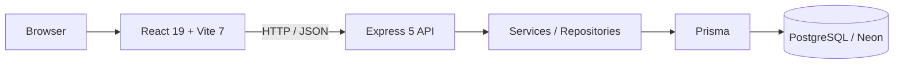

<div align="center">

# Bemmo

### Tecnologia para profissionais do bem-estar

Plataforma SaaS em desenvolvimento para ajudar profissionais autônomos do bem-estar a organizar presença digital, serviços, disponibilidade, agendamentos e operação em um único lugar.

**Showcase técnico · código-fonte principal mantido em repositório privado**

Domínio registrado: **bemmo.com.br** · ainda sem deploy/DNS público nesta etapa

</div>

---

## Sobre o projeto

Muitos profissionais autônomos do bem-estar ainda concentram sua operação em ferramentas como WhatsApp, Instagram, agendas pessoais e controles manuais. Conforme o negócio cresce, agenda, clientes, serviços e comunicação ficam mais difíceis de organizar.

A **Bemmo** nasceu para centralizar essa rotina em uma experiência digital mais organizada e profissional, tanto para quem presta o serviço quanto para quem agenda.

> Este repositório é a vitrine pública do projeto. O código-fonte principal permanece privado. Aqui são documentados produto, arquitetura, decisões técnicas e evolução do desenvolvimento sem expor credenciais, dados reais ou implementação sensível.

---

## Estado atual

A Bemmo está em **desenvolvimento ativo** e já ultrapassou a fase de demo puramente visual.

### Integrado de ponta a ponta

- autenticação e sessão;
- recuperação de senha e verificação de e-mail no produto, ainda sem provedor externo de entrega;
- perfil profissional privado e página pública;
- catálogo de serviços;
- disponibilidade semanal e exceções;
- cálculo de horários reserváveis;
- agendamento público persistido com proteção contra double-booking;
- gestão profissional de agendamentos e ciclo de vida.

### Backend implementado, frontend ainda pendente ou demonstrativo

- reagendamento;
- CRM de clientes;
- histórico do cliente;
- visão financeira;
- avaliações;
- moderação administrativa de avaliações.

### Ainda demonstrativo ou futuro

- marketplace/busca pública integrada a dados reais;
- métricas da home;
- vouchers comerciais;
- pagamentos e assinaturas;
- envio transacional externo de e-mails;
- notificações;
- uploads;
- ambiente público de produção.

A regressão atual do projeto principal possui **139 testes frontend** e **219 testes backend**, além de build de produção e validação Prisma aprovados no fechamento do rebrand Bemmo.

---

## Visão do produto

### Para clientes

- descobrir profissionais;
- visualizar perfil e serviços;
- consultar horários disponíveis;
- solicitar agendamento online;
- acompanhar a experiência de atendimento;
- futuramente adquirir vouchers e avaliar serviços.

### Para profissionais

- manter um perfil profissional;
- gerenciar serviços;
- configurar agenda e exceções;
- receber e administrar agendamentos;
- acompanhar clientes;
- evoluir para uma visão financeira e operacional centralizada.

---

## Arquitetura



Frontend e backend são camadas independentes. Os principais fluxos de autenticação, perfil, serviços, disponibilidade, slots, booking e gestão de agendamentos já consomem a API real. Outros módulos estão sendo integrados gradualmente conforme o backend existente é exposto na experiência do produto.

Mais detalhes em [`docs/ARCHITECTURE.md`](docs/ARCHITECTURE.md).

---

## Stack

### Frontend

- React 19
- Vite 7
- React Router DOM 7
- JavaScript / JSX / ESM
- CSS autoral
- Lucide React
- Playwright em integrações selecionadas
- Node.js native test runner

### Backend

- Node.js
- Express 5
- Prisma 7
- PostgreSQL / Neon
- Zod
- Pino
- Helmet
- CORS
- Express Rate Limit
- Argon2id
- JOSE / JWT

### Engenharia

- aplicação HTTP separada do listener;
- configuração e ambiente validados;
- health e readiness checks;
- erros padronizados;
- logs estruturados com redaction;
- migrations e constraints de banco;
- autenticação com access token em memória e refresh opaco em cookie `HttpOnly`;
- coordenação multi-aba com Web Locks/BroadcastChannel;
- regras transacionais e locks para concorrência de negócio;
- testes automatizados e integrações opt-in com PostgreSQL/Chromium.

---

## Autenticação e segurança

O fluxo inclui:

- cadastro e login reais;
- hashing de senha com Argon2id;
- access token de curta duração;
- refresh token opaco com rotação e revogação;
- logout atual e global;
- restauração de sessão;
- proteção das rotas privadas;
- CORS e validação de origem;
- rate limiting em endpoints sensíveis;
- segredos apenas no backend;
- dados pessoais fora de URLs nos fluxos de booking;
- logging sem credenciais ou payloads sensíveis.

Recuperação e verificação de e-mail já possuem backend e frontend. O que ainda falta é um provedor externo para entregar essas mensagens fora do ambiente de teste.

---

## Estado por área

| Área | Estado atual |
| --- | --- |
| Autenticação frontend + backend | Integrado |
| Perfil profissional | Integrado |
| Serviços | Integrado |
| Disponibilidade e exceções | Integrado |
| Slots reserváveis | Integrado |
| Booking público persistido | Integrado |
| Gestão/lifecycle de agendamentos | Integrado |
| Reagendamento | Backend pronto / frontend pendente |
| CRM e histórico do cliente | Backend pronto / frontend pendente |
| Financeiro | Backend pronto / frontend pendente |
| Avaliações e moderação | Backend pronto / frontend pendente |
| Marketplace público real | Parcial / demo |
| Vouchers comerciais | Planejado |
| Pagamentos e assinaturas | Planejado |
| Notificações | Planejado |
| Deploy público | Não realizado |

Veja mais em [`docs/STATUS.md`](docs/STATUS.md).

---

## Roadmap imediato

```text
Rebrand Bemmo concluído
   ↓
Release candidate / deploy readiness
   ↓
Backend + frontend em ambiente beta
   ↓
Banco separado para beta
   ↓
Domínio e HTTPS
   ↓
Smoke tests de produção
   ↓
Beta fechado com primeiros profissionais
   ↓
Integração dos módulos frontend restantes
   ↓
Pagamentos / vouchers / notificações
```

---

## Objetivos técnicos do projeto

Além do produto, a Bemmo serve como projeto de engenharia full stack para aprofundar práticas como:

- arquitetura por camadas;
- desenho de APIs REST;
- autenticação e sessões;
- PostgreSQL e integridade relacional;
- modelagem multi-entidade;
- concorrência e consistência transacional;
- testes unitários, integração e E2E;
- segurança de aplicações web;
- evolução incremental de protótipo para SaaS operacional.

---

## Sobre este showcase

O objetivo deste repositório é permitir que recrutadores, desenvolvedores e pessoas interessadas entendam **o problema, o produto, a arquitetura e a evolução técnica da Bemmo** sem abrir o código-fonte principal.

A implementação privada continua sendo a fonte de verdade do produto.

---

<div align="center">

**Bemmo · em desenvolvimento**

</div>
