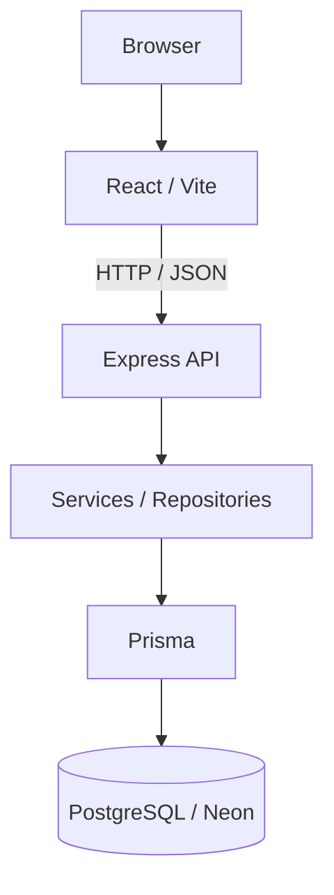

# Arquitetura — Bemmo

## Visão geral

A Bemmo é organizada em duas aplicações principais: um frontend React/Vite e uma API Express. O banco relacional é PostgreSQL, acessado pelo backend através do Prisma.



## Frontend

Tecnologias principais:

- React 19;
- Vite 7;
- React Router DOM 7;
- JavaScript/JSX ESM;
- CSS autoral;
- Lucide React.

A SPA possui páginas públicas, autenticação, dashboard protegido, perfil profissional, serviços, disponibilidade, booking, gestão de agendamentos e páginas institucionais.

Hoje, os fluxos de autenticação, recuperação/verificação de conta, perfil profissional, serviços, disponibilidade, slots reserváveis, booking público e gestão profissional de agendamentos consomem a API real.

Marketplace/busca pública, métricas da home e alguns módulos posteriores ainda permanecem demonstrativos ou pendentes de integração frontend.

## Backend

A API utiliza:

- Node.js;
- Express 5;
- Zod para configuração e validação;
- Helmet;
- CORS explícito;
- rate limiting;
- Pino para logs estruturados;
- Prisma para acesso ao banco.

A aplicação HTTP é criada separadamente do listener, favorecendo testes e encerramento controlado do processo.

O backend segue, em linhas gerais:

```text
Routes
  ↓
Validators / Middlewares
  ↓
Controllers
  ↓
Services
  ↓
Repositories
  ↓
Prisma
  ↓
PostgreSQL
```

## Health e readiness

A API diferencia os conceitos de liveness e readiness:

- **health:** indica que a aplicação está viva sem depender do banco;
- **ready:** verifica se as dependências necessárias estão disponíveis, incluindo conexão com PostgreSQL.

Essa separação permite distinguir falha do processo HTTP de indisponibilidade de dependências externas.

## Autenticação e sessão

O núcleo de autenticação está integrado entre frontend, backend e banco.

Principais decisões:

- senhas armazenadas com Argon2id;
- JWT para access token;
- refresh token opaco em cookie `HttpOnly`;
- hash do refresh persistido no servidor;
- rotação e revogação de sessão;
- cadastro, login, refresh, logout, logout global e `/me`;
- recuperação de senha e verificação de e-mail;
- CORS com credentials e origem explícita;
- proteção de rotas privadas no frontend;
- access token mantido apenas em memória;
- coordenação entre abas com Web Locks e BroadcastChannel.

A entrega externa dos e-mails de recuperação/verificação ainda depende de um provedor transacional futuro.

## Domínios de negócio

### Integrados full stack

- perfil profissional;
- serviços;
- disponibilidade semanal e exceções;
- cálculo público de slots reserváveis;
- booking persistido;
- lifecycle de agendamentos pelo profissional.

### Backend implementado, UI ainda pendente

- reagendamento;
- CRM de clientes;
- histórico/resumo do cliente;
- financeiro;
- avaliações;
- moderação de avaliações.

### Futuros

- vouchers comerciais transacionais;
- pagamentos/assinaturas;
- notificações;
- uploads;
- infraestrutura pública de produção.

## Banco de dados

O PostgreSQL de desenvolvimento está provisionado no Neon e é acessado via Prisma.

O domínio contém entidades relacionadas a identidade, profissionais, clientes, serviços, disponibilidade, agendamentos, vouchers, avaliações, pagamentos, assinaturas e autenticação.

Constraints e relações no banco complementam as validações da aplicação. A documentação diferencia explicitamente modelagem existente de funcionalidade efetivamente operacional.

## Concorrência e consistência

Fluxos sensíveis utilizam transações, locks e validação de estado para evitar condições de corrida, especialmente em autenticação, booking e mudanças de lifecycle de agendamentos.

O booking público trata colisões de slot sem repetir automaticamente uma operação cujo resultado possa ser incerto.

## Estratégia de evolução

A Bemmo vem sendo desenvolvida incrementalmente:

1. experiência de produto e fluxo navegável;
2. fundação do backend e PostgreSQL;
3. autenticação real;
4. perfil, serviços e disponibilidade;
5. slots e booking persistido;
6. gestão profissional de agendamentos;
7. backends de CRM, financeiro e avaliações;
8. preparação de deploy e beta fechado;
9. integração dos módulos frontend restantes;
10. integrações externas e monetização.

Essa abordagem mantém uma separação clara entre protótipo visual, backend existente, integração real e operação de produção.
